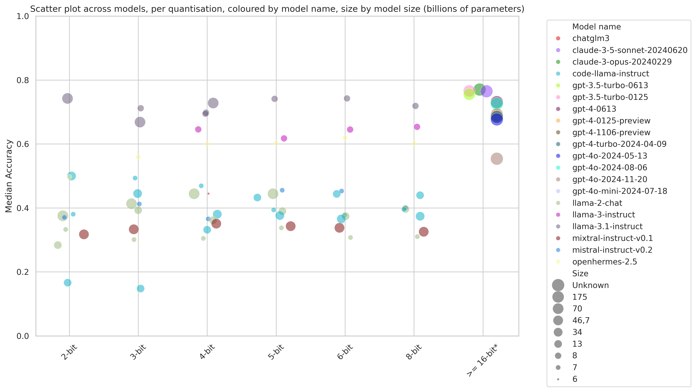

# Benchmark Results - Overview

## Scores per model

Table sorted by mean score in descending order.
Click the column names to reorder.

{{ read_csv('benchmark/results/preprocessed_for_frontend/overview-model.csv', colalign=("left","right")) }}

## Scores per quantisation

Table sorted by mean score in descending order.
Click the column names to reorder.

{{ read_csv('benchmark/results/preprocessed_for_frontend/overview-quantisation.csv', colalign=("left","right")) }}

## Scores of all tasks

Wide table; you may need to scroll horizontally to see all columns.
Table sorted by mean score in descending order.
Click the column names to reorder.

{{ read_csv('benchmark/results/preprocessed_for_frontend/overview.csv', colalign=("left","right")) }}