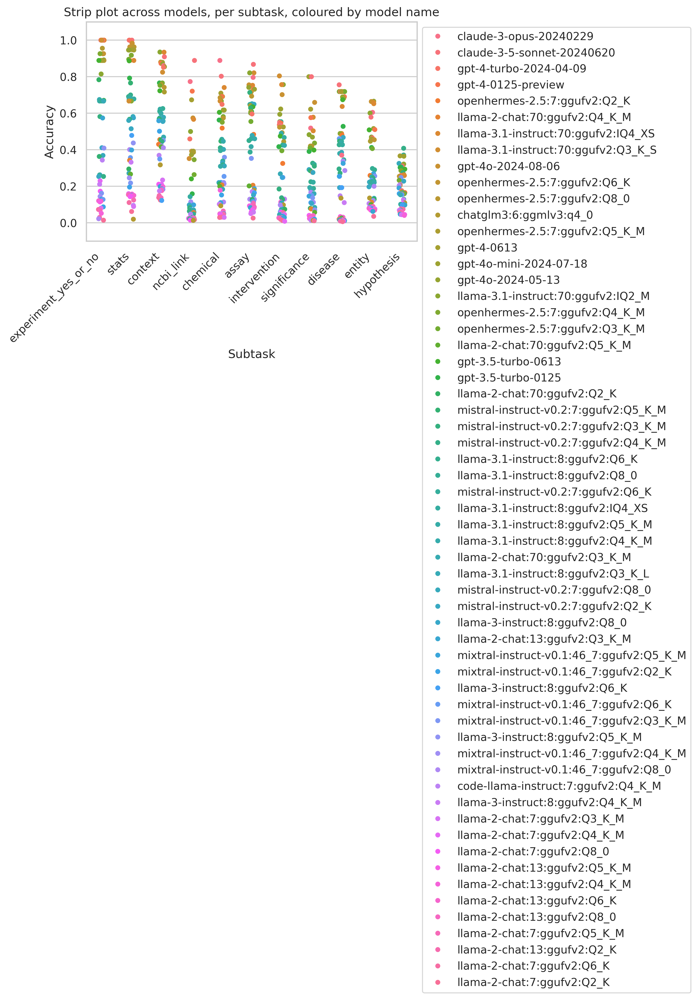

# Benchmark - All Results

## BioCypher query generation

In this set of tasks, we test LLM abilities to generate queries for a BioCypher Knowledge Graph using BioChatter.
The `schema_config.yaml` of the BioCypher Knowledge Graph and a natural language query are passed to BioChatter.

Individual steps of the query generation process are tested separately, as well as the end-to-end performance of the process.

=== "Entity selection"

    {{ read_csv('benchmark/results/processed/entity_selection.csv', colalign=("center","center","center","center","center")) }}

=== "Relationship selection"

    {{ read_csv('benchmark/results/processed/relationship_selection.csv', colalign=("center","center","center","center","center")) }}

=== "Property selection"

    {{ read_csv('benchmark/results/processed/property_selection.csv', colalign=("center","center","center","center","center")) }}

=== "Property confabulation"

    {{ read_csv('benchmark/results/processed/property_exists.csv', colalign=("center","center","center","center","center")) }}

=== "Naive query generation"

    {{ read_csv('benchmark/results/processed/naive_query_generation_using_schema.csv', colalign=("center","center","center","center","center")) }}

=== "BioChatter query generation"

    {{ read_csv('benchmark/results/processed/query_generation.csv', colalign=("center","center","center","center","center")) }}

=== "End to end query generation"

    {{ read_csv('benchmark/results/processed/end_to_end_query_generation.csv', colalign=("center","center","center","center","center")) }}

## Retrieval-Augmented Generation (RAG)

In this set of tasks, we test LLM abilities to generate answers to a given question using a RAG agent, or to judge the relevance of a RAG fragment to a given question.
Instructions can be explicit ("is this fragment relevant to the question?") or implicit (just asking the question without instructions and evaluating whether the model responds with 'not enough information given').

=== "Explicit relevance of single fragments"

    {{ read_csv('benchmark/results/processed/explicit_relevance_of_single_fragments.csv', colalign=("center","center","center","center","center")) }}

=== "Implicit relevance of single fragments"

    {{ read_csv('benchmark/results/processed/implicit_relevance_of_multiple_fragments.csv', colalign=("center","center","center","center","center")) }}

## Text Extraction

In this set of tasks, we test LLM abilities to extract text from a given document.

=== "Overall Performance"

    {{ read_csv('benchmark/results/processed/sourcedata_info_extraction.csv', colalign=("center","center","center","center","center")) }}

=== "Assay extraction"

    {{ read_csv('benchmark/results/processed/extraction_assay.csv', colalign=("center","center","center","center","center")) }}

=== "Chemical extraction"

    {{ read_csv('benchmark/results/processed/extraction_chemical.csv', colalign=("center","center","center","center","center")) }}

=== "Context extraction"

    {{ read_csv('benchmark/results/processed/extraction_context.csv', colalign=("center","center","center","center","center")) }}

=== "Disease extraction"

    {{ read_csv('benchmark/results/processed/extraction_disease.csv', colalign=("center","center","center","center","center")) }}

=== "Entity extraction"

    {{ read_csv('benchmark/results/processed/extraction_entity.csv', colalign=("center","center","center","center","center")) }}

=== "Experiment extraction (yes or no)"

    {{ read_csv('benchmark/results/processed/extraction_experiment_yes_or_no.csv', colalign=("center","center","center","center","center")) }}

=== "Hypothesis extraction"

    {{ read_csv('benchmark/results/processed/extraction_hypothesis.csv', colalign=("center","center","center","center","center")) }}

=== "Intervention extraction"

    {{ read_csv('benchmark/results/processed/extraction_intervention.csv', colalign=("center","center","center","center","center")) }}

=== "Gene identifier mapping"

    {{ read_csv('benchmark/results/processed/extraction_ncbi_link.csv', colalign=("center","center","center","center","center")) }}

=== "Significance extraction"

    {{ read_csv('benchmark/results/processed/extraction_significance.csv', colalign=("center","center","center","center","center")) }}

=== "Statistics extraction"

    {{ read_csv('benchmark/results/processed/extraction_stats.csv', colalign=("center","center","center","center","center")) }}

=== "Image caption yes/no"

    {{ read_csv('benchmark/results/processed/multimodal_answer.csv', colalign=("center","center","center","center","center")) }}

## Medical Exam Question Answering

In this set of tasks, we test LLM abilities to answer medical exam questions.

=== "Overall Performance"

    {{ read_csv('benchmark/results/processed/medical_exam.csv', colalign=("center","center","center","center","center")) }}
