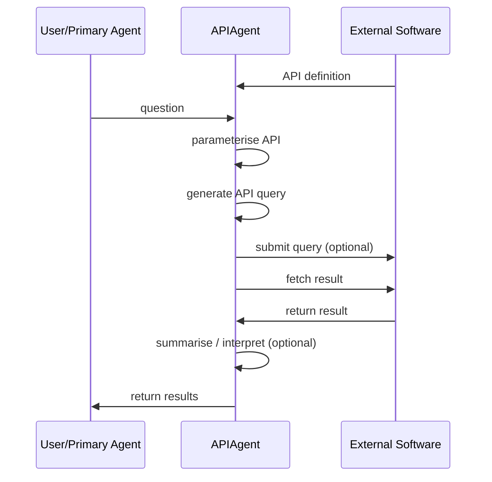

# API Calling

## Overview

BioChatter provides access to biological databases through chat via a custom API
Agent. It is designed to interact with various external APIs and provides a
structured approach to generating queries, fetching results, and interpreting
the responses from different API services. In comparison to the tool binding
approach via MCPs ([In Chat Tool Calling](features/tool_chat.md)), the API
agent approach allows for more flexibility and in-depth manipulation of the
bindings, queries and responses.



## Example: OncoKB Integration

The OncoKB API integration allows users to query oncologically relevant genomic
information. Here's a minimal working example:

```python
from biochatter.llm_connect import GptConversation
from biochatter.api_agent.base.api_agent import APIAgent
from biochatter.api_agent.web.oncokb import OncoKBQueryBuilder, OncoKBFetcher, OncoKBInterpreter

# Set up a conversation factory (you might need to adjust this based on your setup)
def conversation_factory():
    return GptConversation(model_name="gpt-4", prompts={}, correct=False)

# Create an API agent for OncoKB
oncokb_agent = APIAgent(
    conversation_factory=conversation_factory,
    query_builder=OncoKBQueryBuilder(),
    fetcher=OncoKBFetcher(),
    interpreter=OncoKBInterpreter()
)

# Execute a query
question = "What is the oncogenic potential of BRAF V600E mutation?"
result = oncokb_agent.execute(question)

print(result)
```

This example demonstrates how to set up and use the OncoKB API agent to query
genomic information. The execute method handles the entire process of query
generation, API interaction, and result interpretation.

## Core components

The API agent module is organized into three main submodules:

- `base`: Contains core abstractions and base classes
- `web`: Implementations for web-based APIs (e.g., OncoKB, BLAST)
- `python`: Implementations for Python package APIs (e.g., Scanpy)

### API Agent

The main class that orchestrates the API interaction process, located in
`biochatter.api_agent.base.api_agent`.

Key Methods:

- `execute(question: str) -> Optional[str]`: Executes the full API interaction
pipeline.

- `parameterise_query(question: str) -> Optional[BaseModel]`: Generates a
structured query based on the input question.

- `fetch_results(query_model: "BaseModel") -> Optional[str]`: Retrieves results
from the API.

- `summarise_results(question: str, response_text: str) -> Optional[str]`:
Interprets and summarizes the API response with respect to the question.

### QueryParameters

The `QueryParameters` class is a Pydantic model that defines the structure and
validation rules for API query parameters. It serves several important purposes:

- Structure Definition: It clearly defines all the parameters required for an
API call, including their types and default values.

- Validation: Pydantic automatically validates the data, ensuring that all
required fields are present and that the data types are correct.

- Documentation: Each field can include a description, providing clear
documentation for developers and assisting the LLM in understanding how to use
each parameter.

- Type Hinting: It provides type hints, improving code readability and enabling
better IDE support.

- Serialization: The Pydantic model can easily be serialized to and deserialized
from JSON, facilitating data transfer.

### Base Classes

Located in `biochatter.api_agent.base.agent_abc`:

#### BaseQueryBuilder

Abstract base class for creating query builders specific to different APIs.

Key Methods:

- `create_runnable(query_parameters: BaseModel, conversation: Conversation) ->
Callable`: Creates runnable object for executing queries.

- `parameterise_query(question: str, conversation: Conversation) -> BaseModel`:
Generates a parameterized query object based on the input question.

#### BaseFetcher

An abstract base class for implementing API-specific data fetching logic.

Key Method:

- `fetch_results(query_model)`: Submits the query to the API and retrieves the
results.

#### BaseInterpreter

An abstract base class for implementing API-specific response interpretation
logic.

Key Method:

- `summarise_results(question: str, conversation_factory: Callable,
response_text: str) -> str`: Summarizes and interprets the API response.

## Setting up a new API integration

### Overview

Create specific implementations of QueryParameters, BaseQueryBuilder,
BaseFetcher, and BaseInterpreter for your target API and design prompts.
Instantiate an APIAgent with these components. Use the execute method of
APIAgent to process questions and interact with the API.

#### 1. Specific QueryParameters

For each field in your API call a Pydantic field is created. The description
must be clear and concise to be understandable by a LLM so that it will fill the
field with the appropriate arguments.

```python
from pydantic import BaseModel, Field

class NewAPIQueryParameters(BaseModel):
    endpoint: str = Field(..., description="API endpoint")
    param1: str = Field(..., description="Description of param1")
    param2: int = Field(default=0, description="Description of param2")
    # Add more parameters as needed
```

#### 2. Prompt design

##### QUERY_PROMPT: instructions for structured output to write NewAPI call.

Create a prompt that will allow the LLM to obtain sufficient context to fill the
Fields in the NewAPIQueryParameters class. Always keep the first two sentences.
Secondly, provide instructions on how to interpret questions. Finally, for LLMs
with large context windows the entire API documentation can be copy pasted
inside of the prompt. Examples of API calls to retrieve the relevant information
to a question should also be provided.

```python
NewAPI_QUERY_PROMPT = """
You are a world class algorithm for creating queries in structured formats. Your task is to use OncoKB Web APIs to answer genomic questions.

API DOCUMENTATION AND EXAMPLES"""
```

##### SUMMARY_PROMPT: Instructions on how to interpret and answer user questions based on retrieved information

Follow prompt design below, replace NewAPI accordingly. If results are not
satisfactory, engineer the prompts further.

```python
NewAPI_SUMMARY_PROMPT = """
You have to answer this question in a clear and concise manner: {question} Be factual!\n\
You are a world leading NewAPI domain specialist who knows everything about NewAPI results.\n\
Do not make up information, only use the provided information and mention how relevant the found information is based on your knowledge about NewAPI\n\
Here is the information relevant to the question found on NewAPI:\n\
{context}
"""
```

#### 3. Implement QueryBuilder
Create a class that inherits from BaseQueryBuilder:

```python
from biochatter.api_agent.base.agent_abc import BaseQueryBuilder

class NewAPIQueryBuilder(BaseQueryBuilder):
    def create_runnable(self,
        query_parameters: NewAPIQueryParameters,
        conversation: Conversation
        ) -> Callable:
        # Implement method to create a runnable query object
        return create_structured_output_runnable(
            output_schema=query_parameters,
            llm=conversation.chat,
            prompt=self.structured_output_prompt,
        )
    def parameterise_query(self,
        question: str,
        conversation: Conversation
        ) -> NewAPIQueryParameters:
        # Implement method to generate API parameters from a question
        runnable = self.create_runnable(
            query_parameters=NewAPIQueryParameters,
            conversation=conversation,
        )
        NewAPI_call_obj = runnable.invoke(
            {"input": f"Answer:\n{question} based on:\n {NewAPI_QUERY_PROMPT}"}
        )
       NewAPI_call_obj.question_uuid = str(uuid.uuid4())
        return NewAPI_call_obj
```

#### 4. Implement Fetcher

Create a class that inherits from BaseFetcher. Adapt request header in
initiation if specific API tokens are required, and implement a logic to build
the full URL required for the API call from NewAPIQueryParameters, and execute
it.

The `fetch_results` method should return the response text from the API. If this
is a two-stage process (e.g., submitting a query and then retrieving the
results), you should implement the necessary logic to handle this. You can look
at the BLAST fetcher for an example (`blast.py`).

It may be useful to tune the retries parameter to handle network issues or, as
in the case of BLAST, the computational time required to process the query.

NOTE: if the response is too large for your LLM context window you may have to
reduce its size in some way.

```python
from biochatter.api_agent.base.agent_abc import BaseFetcher

class NewAPIFetcher(BaseFetcher):
        def __init__(self,):
        self.headers = {
        }
        self.base_url = "https://api.new.org/api/"

    def fetch_results(
        self,
        query_model: NewAPIQueryParameters,
        retries: int = 3,
    ) -> str:
    #implement your logic here
    return results_response.text
```

#### 5. Implement Interpreter
Create a class that inherits from BaseInterpreter and adapt the system prompt to
NewAPI.

```python
from biochatter.api_agent.base.agent_abc import BaseInterpreter

class NewAPIInterpreter(BaseInterpreter):
    def summarise_results(self,
        question: str,
        conversation_factory: Callable,
        response_text: str) -> str:

        prompt = ChatPromptTemplate.from_messages(
            [
                (
                    "system",
                    "You are a world NewAPI specialist who knows everything about NewAPI topic and its results.",
                ),
                ("user", "{input}"),
            ]
        )
        summary_prompt = NewAPI_SUMMARY_PROMPT.format(
            question=question, context=response_text
        )
        output_parser = StrOutputParser()
        conversation = conversation_factory()
        chain = prompt | conversation.chat | output_parser
        answer = chain.invoke({"input": {summary_prompt}})
        return answer
```

#### 6. Integrate with APIAgent

Once you have implemented all components, you can use them with the APIAgent:

```python
from biochatter.api_agent.base.api_agent import APIAgent

new_api_agent = APIAgent(
    conversation_factory=your_conversation_factory,
    query_builder=NewAPIQueryBuilder(),
    fetcher=NewAPIFetcher(),
    interpreter=NewAPIInterpreter()
)

result = new_api_agent.execute("Your question here")
```
