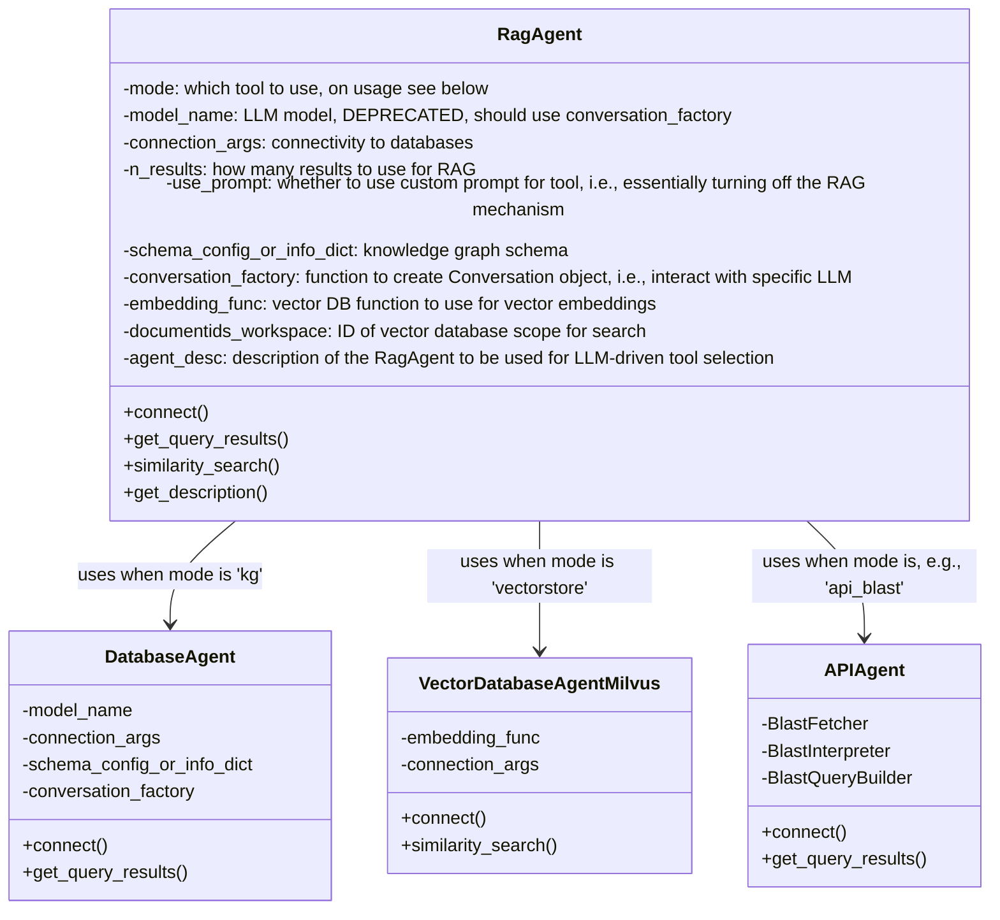
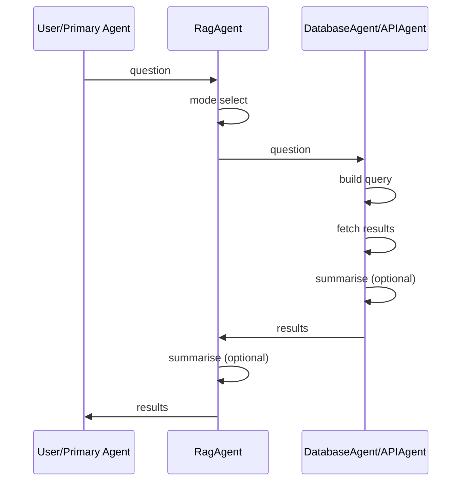
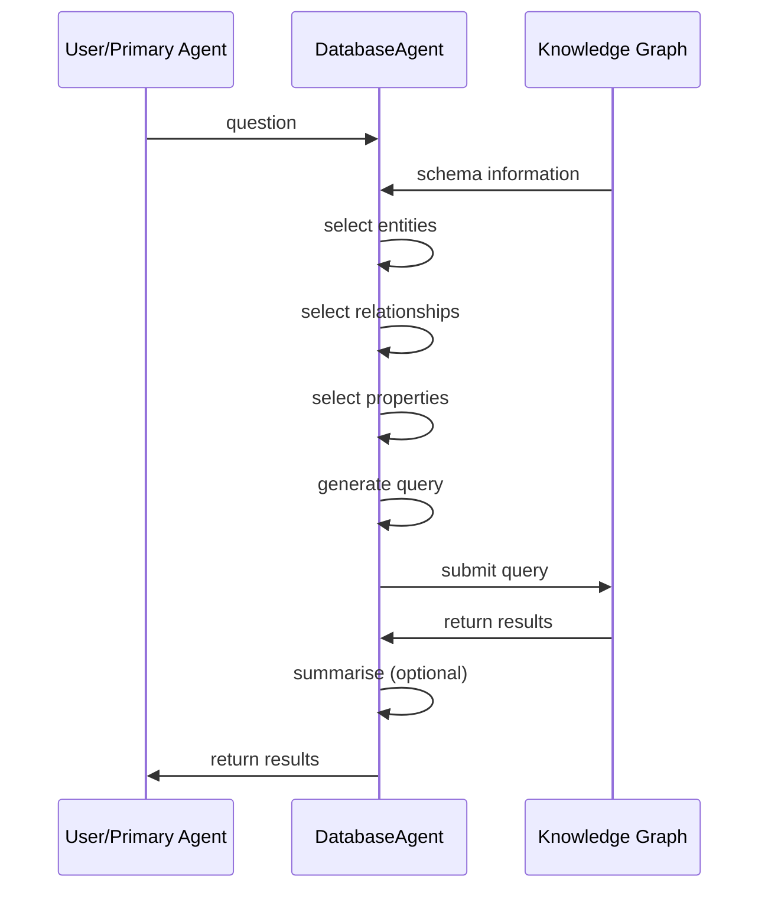
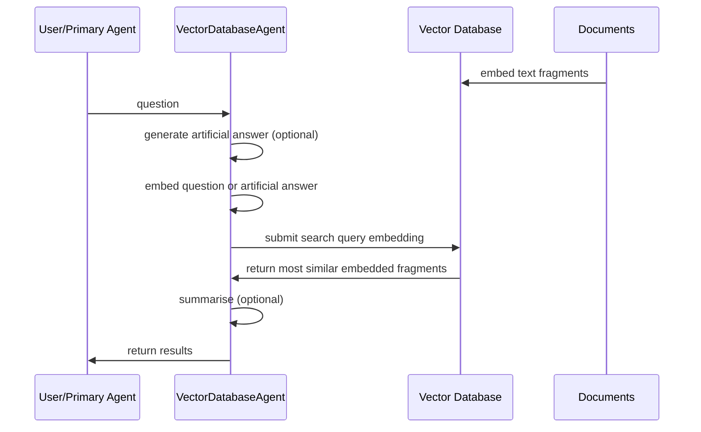

# Retrieval-Augmented Generation

## Overview

To provide a unified interface for various ways of retrieval-augmented
generation (RAG), we provide an implementation that connects to different types
of databases and APIs.  These functions are provided by the `RagAgent` class,
which encapsulates the connection, query, search, retrieval, and summarisation
functions of the individual agents.



Each instance of an agent is responsible for receiving a user's question, using
the appropriate method to generate queries, fetching results, and returning them
in a structured or summarised format to the agent that called it (often, the
"primary" conversation between the user and an LLM). The decision on which LLM
to use is made in supplying a `conversation_factory` function to the agent. For
tool choice, in addition to manual selection, we can also use the
`RagAgentSelector` class from `selector_agent.py` to automatically select the
most appropriate tool based on the question and the description (`agent_desc`)
of the available agents. For more information on the workflows used inside the
individual agents, see the documentation for the [Knowledge
Graph](#knowledge-graph-rag)-, [Vector Store](#vectorstore-rag)-, and [API
Agents](#api-calling).



## Knowledge Graph RAG

To increase accessibility of databases, we can leverage the
[BioCypher](https://biocypher.org) integration of BioChatter.  In BioCypher, we
use a YAML configuration (`schema_config.yaml`) to specify the contents of the
knowledge graph and their ontological associations.  We also generate a more
extensive, but essentially similar YAML file during the BioCypher creation of a
knowledge graph (`schema_info.yaml`), which contains more information pertinent
to LLM interaction with the database.  The current prototypical implementation
of query generation through an LLM is implemented in the `prompts.py` module on
the example of a Neo4j knowledge graph connection.



### Connecting

The database connectivity of BioChatter to BioCypher knowledge graphs is handled
by the `DatabaseAgent` class (in `database_agent.py`). In addition, database
connectivity can also be handled by the application that uses BioChatter, as
shown in the example below. In that case, the application implements calls to
the `BioCypherPromptEngine` class directly without going through the
`DatabaseAgent`. To illustrate this simpler procedure, we provide an example of
Neo4j query generation as used in the [Pole Crime Dataset demo
repository](https://github.com/biocypher/pole).

### Querying

The generation of a query based on BioCypher configuration files is a multi-step
process. This is partly to account for the limited token input space of some
models, and partly to better be able to test and compare the individual steps.
The steps can also be wrapped in a single function, `generate_query`, which
handles the entire process. In addition, we can use the [Reflexion
Agent](reflexion-agent.md) to iteratively improve a query based on its results.

#### Setup

We use the `BioCypherPromptEngine` class to handle the LLM conversation.

```python
from biochatter.prompts import BioCypherPromptEngine
prompt_engine = BioCypherPromptEngine(
    schema_config_or_info_path="test/schema_info.yaml"
)
```

This will load the `schema_config.yaml` or `schema_info.yaml` (preferred) file
and set up the conversation.

#### Query generation

Using the `generate_query` wrapper, we can generate a query from a question and
a database language.

```python
query = prompt_engine.generate_query(
    question="Which genes are associated with mucoviscidosis?",
    query_language="Cypher",
)
```

This will return a query that can be used in the database query language (e.g.,
Cypher). This end-to-end process executes the steps detailed below, namely,
entity selection, relationship selection, and property selection, as well as the
generation of the final query using the selected components. While you can run
each of these steps individually, you need to ensure that the process is run in
the correct order, passing the results of each step to the next step as
implemented in the `generate_query` wrapper. The individual steps below are
provided for explanation and testing purposes.

##### Entity selection

Starting from the `schema_config.yaml` or `schema_info.yaml` (preferred) file,
we first have the model decide which entities in the database are relevant to
the user's question.

```python
success = prompt_engine._select_entities(
    question="Which genes are associated with mucoviscidosis?"
)
```

This will select a number of entities from the database schema to be used
subsequently, and return True or False to indicate success.

##### Relationship selection

Next, we will use the entities determined in the first step to select
relationships between them.  The entities selected in the first step will be
stored in the `selected_entities` attribute of the `BioCypherPromptEngine`
instance, and the question is stored in the `question` attribute.  Both are
automatically used to select relationships.

```python
success = prompt_engine._select_relationships()
```

##### Property selection

To not unnecessarily waste token input space, we are only interested in
selecting properties of entities that are of interest given the question asked.
We do so in the third step, which uses the entities and relationships determined
in the first steps.  Again, `question`, `selected_entities`, and
`selected_relationships` are automatically used to select properties.

```python
success = prompt_engine._select_properties()
```

This will select a number of properties to be used in the query, and also return
True or False to indicate success.

##### Query generation

Finally, we can use the entities and relationships, as well as the selected
properties, to ask the LLM to generate a query in the desired language.

```python
query = prompt_engine._generate_query(
    question="Which genes are associated with mucoviscidosis?",
    entities=["Gene", "Disease"],
    relationships=["GeneToDiseaseAssociation"],
    properties={"Disease": ["name", "ICD10", "DSM5"]},
    database_language="Cypher",
)
```

This will (hopefully) return a query that can be used in the database query
language (e.g., Cypher).

#### Query interaction

As an optional follow-up, you can interact with the returned query using the
`BioCypherQueryHandler` class (`query_interaction.py`). It takes the query, the
original question and the KG information so that the interaction is still aware
of the KG.

```python
from biochatter.query_interaction import BioCypherQueryHandler
query_handler = BioCypherQueryHandler(
    query=query,
    query_lang="Cypher",
    kg_selected={
        entities: ["Gene", "Disease"],
        relationships: ["GeneToDiseaseAssociation"],
        properties: {"Disease": ["name", "ICD10", "DSM5"]}
    },
    question="Which genes are associated with mucoviscidosis?"
)
```

##### Explanation

You can retrieve an explanation of the returned query with:

```python
explanation = query_handler.explain_query()
```

##### Updating

Alternatively, you can ask the LLM for an update of the query with:

```python
request = "Only return 10 results and sort them alphabetically"
explanation = query_handler.update_query(request)
```

NB: for updates, it might sometimes be relevant that all the KG
enitites/relationships/properties are known to the LLM instead
of only those that were selected to be relevant for the original question.
For this, you can optionally pass them as input to the query handler
with `kg` (similar to `kg_selected`).

(Tip: the prompt_engine object contains both the selected and non-selected
entities, relationships, and properties as attributes.)

## Vectorstore RAG

To connect to a vector database for using semantic similarity search and
retrieval-augmented generation (RAG), we provide an implementation that connects
to a [Milvus](https://milvus.io) instance (local or remote).  These functions
are provided by the modules `vectorstore.py` (for performing embeddings) and
`vectorstore_agent.py` (for maintaining the connection and search).

This is implemented in the [BioChatter
Light](https://github.com/biocypher/biochatter-light) Docker workflow and the
BioChatter Docker compose found in this repository.  To start Milvus on its own
in these repositories, you can call `docker compose up -d standalone`
(`standalone` being the Milvus endpoint, which starts two other services
alongside it).



### Connecting

To connect to a vector DB host, we can use the corresponding class:

```python
from biochatter.vectorstore_agent import VectorDatabaseAgentMilvus

dbHost = VectorDatabaseAgentMilvus(
    embedding_func=GoogleGenerativeAIEmbeddings(),
    connection_args={"host": _HOST, "port": _PORT},
    embedding_collection_name=EMBEDDING_NAME,
    metadata_collection_name=METADATA_NAME
)
dbHost.connect()
```

This establishes a connection with the vector database (using a host IP and
port) and uses two collections, one for the embeddings and one for the metadata
of embedded text (e.g. the title and authors of the paper that was embedded).

### Embedding documents

To embed text from documents, we use the LangChain and BioChatter
functionalities for processing and passing the text to the vector database.

```python
from biochatter.vectorstore import DocumentReader()
from langchain.text_splitter import RecursiveCharacterTextSplitter

# read and split document at `pdf_path`
reader = DocumentReader()
docs = reader.load_document(pdf_path)
text_splitter = RecursiveCharacterTextSplitter(
    chunk_size=chunk_size,
    chunk_overlap=chunk_overlap,
    separators=[" ", ",", "\n"],
)
split_text = text_splitter.split_documents(docs)

# embed and store embeddings in the connected vector DB
doc_id = dbHost.store_embeddings(splitted_docs)
```

The dbHost class takes care of calling an embedding model, storing the embedding
in the database, and returning a document ID that can be used to refer to the
stored document.

### Semantic search

To perform a semantic similarity search, all that is left to do is pass a
question or statement to the `dbHost`, which will be embedded and compared to
the present embeddings, returning a number `k` most similar text fragments.

```python
results = dbHost.similarity_search(
    query="Semantic similarity search query",
    k=3,
)
```

### Vectorstore management

Using the collections we created at setup, we can delete entries in the vector
database using their IDs. We can also return a list of all collected docs to
determine which we want to delete.

```python
docs = dbHost.get_all_documents()
res = dbHost.remove_document(docs[0]["id"])
```

## API Calling

API calling functionality now has its own [docs page](api.md).