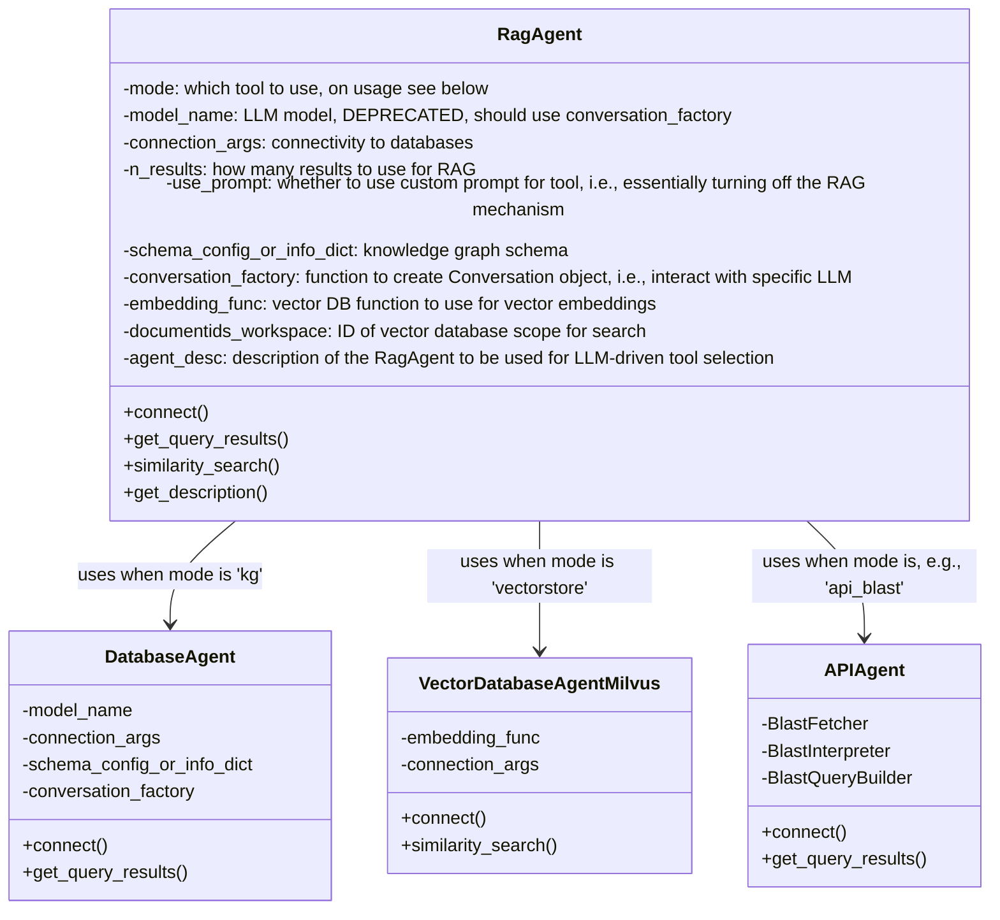
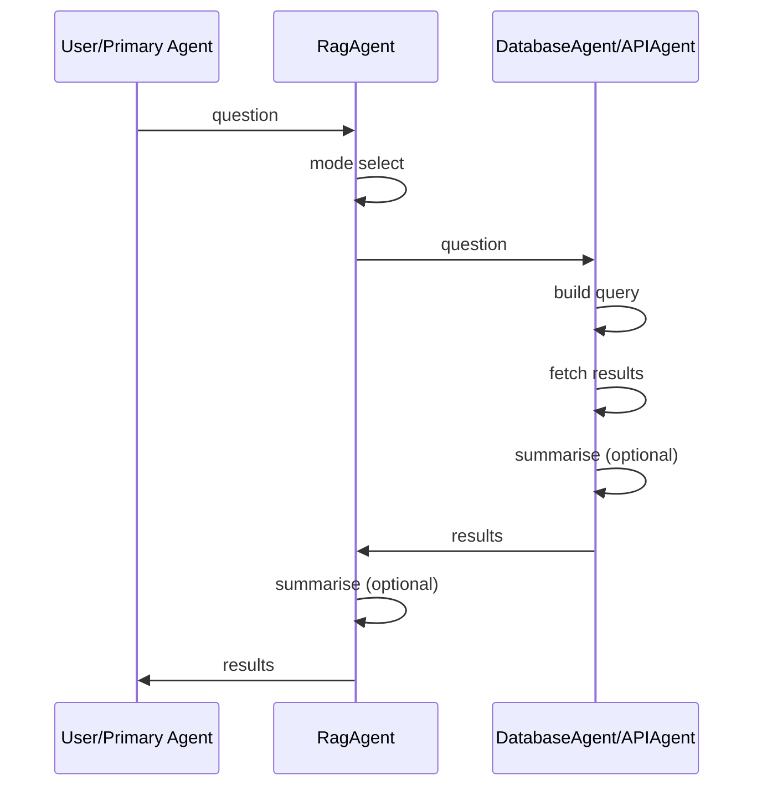

# Retrieval-Augmented Generation (RAG)

## Overview

To provide a unified interface for various ways of retrieval-augmented
generation (RAG), we provide an implementation that connects to different types
of databases and APIs.  These functions are provided by the `RagAgent` class,
which encapsulates the connection, query, search, retrieval, and summarisation
functions of the individual agents.



Each instance of an agent is responsible for receiving a user's question, using
the appropriate method to generate queries, fetching results, and returning them
in a structured or summarised format to the agent that called it (often, the
"primary" conversation between the user and an LLM). The decision on which LLM
to use is made in supplying a `conversation_factory` function to the agent. For
tool choice, in addition to manual selection, we can also use the
`RagAgentSelector` class from `selector_agent.py` to automatically select the
most appropriate tool based on the question and the description (`agent_desc`)
of the available agents. For more information on the workflows used inside the
individual agents, see the documentation for the [Knowledge
Graph](#knowledge-graph-rag)-, [Vector Store](#vectorstore-rag)-, and [API
Agents](#api-calling).



## Knowledge Graph RAG

To increase accessibility of databases, we can leverage the
[BioCypher](https://biocypher.org) integration of BioChatter.  In BioCypher, we
use a YAML configuration (`schema_config.yaml`) to specify the contents of the
knowledge graph and their ontological associations.  We also generate a more
extensive, but essentially similar YAML file during the BioCypher creation of a
knowledge graph (`schema_info.yaml`), which contains more information pertinent
to LLM interaction with the database.  The current prototypical implementation
of query generation through an LLM is implemented in the `prompts.py` module on
the example of a Neo4j knowledge graph connection.

### Connecting

The database connectivity of BioChatter to BioCypher knowledge graphs is handled
by the `DatabaseAgent` class (in `database_agent.py`). In addition, database
connectivity can also be handled by the application that uses BioChatter, as
shown in the example below. In that case, the application implements calls to
the `BioCypherPromptEngine` class directly without going through the
`DatabaseAgent`. To illustrate this simpler procedure, we provide an example of
Neo4j query generation as used in the [Pole Crime Dataset demo
repository](https://github.com/biocypher/pole).

### Querying

The generation of a query based on BioCypher configuration files is a multi-step
process. This is partly to account for the limited token input space of some
models, and partly to better be able to test and compare the individual steps.
The steps can also be wrapped in a single function, `generate_query`, which
handles the entire process. In addition, we can use the [Reflexion
Agent](../reflexion-agent) to iteratively improve a query based on its results.

#### Setup

We use the `BioCypherPromptEngine` class to handle the LLM conversation.

```python
from biochatter.prompts import BioCypherPromptEngine
prompt_engine = BioCypherPromptEngine(
    schema_config_or_info_path="test/schema_info.yaml"
)
```

This will load the `schema_config.yaml` or `schema_info.yaml` (preferred) file
and set up the conversation.

#### Query generation

Using the `generate_query` wrapper, we can generate a query from a question and
a database language.

```python
query = prompt_engine.generate_query(
    question="Which genes are associated with mucoviscidosis?",
    database_language="Cypher",
)
```

This will return a query that can be used in the database query language (e.g.,
Cypher). This end-to-end process executes the steps detailed below, namely,
entity selection, relationship selection, and property selection, as well as the
generation of the final query using the selected components. You can run each of
these steps individually, if you want.

##### Entity selection

Starting from the `schema_config.yaml` or `schema_info.yaml` (preferred) file,
we first have the model decide which entities in the database are relevant to
the user's question.

```python
success = prompt_engine._select_entities(
    question="Which genes are associated with mucoviscidosis?"
)
```

This will select a number of entities from the database schema to be used
subsequently, and return True or False to indicate success.

##### Relationship selection

Next, we will use the entities determined in the first step to select
relationships between them.  The entities selected in the first step will be
stored in the `selected_entities` attribute of the `BioCypherPromptEngine`
instance, and the question is stored in the `question` attribute.  Both are
automatically used to select relationships.

```python
success = prompt_engine._select_relationships()
```

##### Property selection

To not unnecessarily waste token input space, we are only interested in
selecting properties of entities that are of interest given the question asked.
We do so in the third step, which uses the entities and relationships determined
in the first steps.  Again, `question`, `selected_entities`, and
`selected_relationships` are automatically used to select properties.

```python
success = prompt_engine._select_properties()
```

This will select a number of properties to be used in the query, and also return
True or False to indicate success.

##### Query generation

Finally, we can use the entities and relationships, as well as the selected
properties, to ask the LLM to generate a query in the desired language.

```python
query = prompt_engine._generate_query(
    question="Which genes are associated with mucoviscidosis?",
    entities=["Gene", "Disease"],
    relationships=["GeneToDiseaseAssociation"],
    properties={"Disease": ["name", "ICD10", "DSM5"]},
    database_language="Cypher",
)
```

This will (hopefully) return a query that can be used in the database query
language (e.g., Cypher).

#### Query interaction

As an optional follow-up, you can interact with the returned query using the
`BioCypherQueryHandler` class (`query_interaction.py`). It takes the query, the
original question and the KG information so that the interaction is still aware
of the KG.

```python
from biochatter.query_interaction import BioCypherQueryHandler
query_handler = BioCypherQueryHandler(
    query=query,
    query_lang="Cypher",
    kg_selected={
        entities: ["Gene", "Disease"],
        relationships: ["GeneToDiseaseAssociation"],
        properties: {"Disease": ["name", "ICD10", "DSM5"]}
    },
    question="Which genes are associated with mucoviscidosis?"
)
```

##### Explanation

You can retrieve an explanation of the returned query with:

```python
explanation = query_handler.explain_query()
```

##### Updating

Alternatively, you can ask the LLM for an update of the query with:

```python
request = "Only return 10 results and sort them alphabetically"
explanation = query_handler.update_query(request)
```

NB: for updates, it might sometimes be relevant that all the KG
enitites/relationships/properties are known to the LLM instead
of only those that were selected to be relevant for the original question.
For this, you can optionally pass them as input to the query handler
with `kg` (similar to `kg_selected`).

(Tip: the prompt_engine object contains both the selected and non-selected
entities, relationships, and properties as attributes.)

## Vectorstore RAG

To connect to a vector database for using semantic similarity search and
retrieval-augmented generation (RAG), we provide an implementation that connects
to a [Milvus](https://milvus.io) instance (local or remote).  These functions
are provided by the modules `vectorstore.py` (for performing embeddings) and
`vectorstore_agent.py` (for maintaining the connection and search).

This is implemented in the [BioChatter
Light](https://github.com/biocypher/biochatter-light) Docker workflow and the
BioChatter Docker compose found in this repository.  To start Milvus on its own
in these repositories, you can call `docker compose up -d standalone`
(`standalone` being the Milvus endpoint, which starts two other services
alongside it).

### Connecting

To connect to a vector DB host, we can use the corresponding class:

```python
from biochatter.vectorstore_agent import VectorDatabaseAgentMilvus

dbHost = VectorDatabaseAgentMilvus(
    embedding_func=OpenAIEmbeddings(),
    connection_args={"host": _HOST, "port": _PORT},
    embedding_collection_name=EMBEDDING_NAME,
    metadata_collection_name=METADATA_NAME
)
```

This establishes a connection with the vector database (using a host IP and
port) and uses two collections, one for the embeddings and one for the metadata
of embedded text (e.g. the title and authors of the paper that was embedded).

### Embedding documents

To embed text from documents, we use the LangChain and BioChatter
functionalities for processing and passing the text to the vector database.

```python
from biochatter.vectorstore import DocumentReader()
from langchain.text_splitter import RecursiveCharacterTextSplitter

# read and split document at `pdf_path`
reader = DocumentReader()
docs = reader.load_document(pdf_path)
text_splitter = RecursiveCharacterTextSplitter(
    chunk_size=chunk_size,
    chunk_overlap=chunk_overlap,
    separators=[" ", ",", "\n"],
)
split_text = text_splitter.split_documents(docs)

# embed and store embeddings in the connected vector DB
doc_id = dbHost.store_embeddings(splitted_docs)
```

The dbHost class takes care of calling an embedding model, storing the embedding
in the database, and returning a document ID that can be used to refer to the
stored document.

### Semantic search

To perform a semantic similarity search, all that is left to do is pass a
question or statement to the `dbHost`, which will be embedded and compared to
the present embeddings, returning a number `k` most similar text fragments.

```python
results = dbHost.similarity_search(
    query="Semantic similarity search query",
    k=3,
)
```

### Vectorstore management

Using the collections we created at setup, we can delete entries in the vector
database using their IDs. We can also return a list of all collected docs to
determine which we want to delete.

```python
docs = dbHost.get_all_documents()
res = dbHost.remove_document(docs[0]["id"])
```

## API Calling

### Overview

BioChatter provides access to biological databases through chat via the API
Agent. It is designed to interact with various external APIs and provides a
structured approach to generating queries, fetching results, and interpreting
the responses from different API services.


### Example: OncoKB Integration

The OncoKB API integration allows users to query oncologically relevant genomic
information. Here's a minimal working example:

```python
from biochatter.llm_connect import GptConversation
from biochatter.api_agent.api_agent import APIAgent
from biochatter.api_agent.oncokb import OncoKBQueryBuilder, OncoKBFetcher, OncoKBInterpreter

# Set up a conversation factory (you might need to adjust this based on your setup)
def conversation_factory():
    return GptConversation(model_name="gpt-4", prompts={}, correct=False)

# Create an API agent for OncoKB
oncokb_agent = APIAgent(
    conversation_factory=conversation_factory,
    query_builder=OncoKBQueryBuilder(),
    fetcher=OncoKBFetcher(),
    interpreter=OncoKBInterpreter()
)

# Execute a query
question = "What is the oncogenic potential of BRAF V600E mutation?"
result = oncokb_agent.execute(question)

print(result)
```

This example demonstrates how to set up and use the OncoKB API agent to query
genomic information. The execute method handles the entire process of query
generation, API interaction, and result interpretation.

### Core components

#### API Agent

The main class that orchestrates the API interaction process.

Key Methods:

- `execute(question: str) -> Optional[str]`: Executes the full API interaction
pipeline.

- `parameterise_query(question: str) -> Optional[BaseModel]`: Generates a
structured query based on the input question.

- `fetch_results(query_model: "BaseModel") -> Optional[str]`: Retrieves results
from the API.

- `summarise_results(question: str, response_text: str) -> Optional[str]`:
Interprets and summarizes the API response with respect to the question.

#### QueryParameters

The `QueryParameters` class is a Pydantic model that defines the structure and
validation rules for API query parameters. It serves several important purposes:

- Structure Definition: It clearly defines all the parameters required for an
API call, including their types and default values.

- Validation: Pydantic automatically validates the data, ensuring that all
required fields are present and that the data types are correct.

- Documentation: Each field can include a description, providing clear
documentation for developers and assisting the LLM in understanding how to use
each parameter.

- Type Hinting: It provides type hints, improving code readability and enabling
better IDE support.

- Serialization: The Pydantic model can easily be serialized to and deserialized
from JSON, facilitating data transfer.

#### BaseQueryBuilder

Abstract base class for creating query builders specific to different APIs.

Key Methods:

- `create_runnable(query_parameters: BaseModel, conversation: Conversation) ->
Callable`: Creates runnable object for executing queries.

- `parameterise_query(question: str, conversation: Conversation) -> BaseModel`:
Generates a parameterized query object based on the input question.

#### BaseFetcher

An abstract base class for implementing API-specific data fetching logic.

Key Method:

- `fetch_results(query_model)`: Submits the query to the API and retrieves the
results.

#### BaseInterpreter

An abstract base class for implementing API-specific response interpretation
logic.

Key Method:

- `summarise_results(question: str, conversation_factory: Callable,
response_text: str) -> str`: Summarizes and interprets the API response.

## Setting up a new API integration

### Overview

Create specific implementations of QueryParameters, BaseQueryBuilder,
BaseFetcher, and BaseInterpreter for your target API and design prompts.
Instantiate an APIAgent with these components.  Use the execute method of
APIAgent to process questions and interact with the API.

#### 1. Specific QueryParameters

For each field in your API call a Pydantic field is created. The description
must be clear and concise to be understandable by a LLM so that it will fill the
field with the appropriate arguments.


```python
from pydantic import BaseModel, Field

class NewAPIQueryParameters(BaseModel):
    endpoint: str = Field(..., description="API endpoint")
    param1: str = Field(..., description="Description of param1")
    param2: int = Field(default=0, description="Description of param2")
    # Add more parameters as needed
```
#### 2. Prompt design

##### QUERY_PROMPT: instructions for structured output to write NewAPI call.

Create a prompt that will allow the LLM to obtain sufficient context to fill the
Fields in the NewAPIQueryParameters class. Always keep the first two sentences.
Secondly, provide instructions on how to interpret questions. Finally, for LLMs
with large context windows the entire API documentation can be copy pasted
inside of the prompt. Examples of API calls to retrieve the relevant information
to a question should also be provided.

```python
NewAPI_QUERY_PROMPT = """
You are a world class algorithm for creating queries in structured formats. Your task is to use OncoKB Web APIs to answer genomic questions.

API DOCUMENTATION AND EXAMPLES"""
```
##### SUMMARY_PROMPT: Instructions on how to interpret and answer user questions based on retrieved information

Follow prompt design below, replace NewAPI accordingly. If results are not
satisfactory, engineer the prompts further.

```python
NewAPI_SUMMARY_PROMPT = """
You have to answer this question in a clear and concise manner: {question} Be factual!\n\
You are a world leading NewAPI domain specialist who knows everything about NewAPI results.\n\
Do not make up information, only use the provided information and mention how relevant the found information is based on your knowledge about NewAPI\n\
Here is the information relevant to the question found on NewAPI:\n\
{context}
"""
```

#### 3. Implement QueryBuilder
Create a class that inherits from BaseQueryBuilder:

```python
from biochatter.api_agent.abc import BaseQueryBuilder

class NewAPIQueryBuilder(BaseQueryBuilder):
    def create_runnable(self,
        query_parameters: NewAPIQueryParameters,
        conversation: Conversation
        ) -> Callable:
        # Implement method to create a runnable query object
        return create_structured_output_runnable(
            output_schema=query_parameters,
            llm=conversation.chat,
            prompt=self.structured_output_prompt,
        )
    def parameterise_query(self,
        question: str,
        conversation: Conversation
        ) -> NewAPIQueryParameters:
        # Implement method to generate API parameters from a question
        runnable = self.create_runnable(
            query_parameters=NewAPIQueryParameters,
            conversation=conversation,
        )
        NewAPI_call_obj = runnable.invoke(
            {"input": f"Answer:\n{question} based on:\n {NewAPI_QUERY_PROMPT}"}
        )
       NewAPI_call_obj.question_uuid = str(uuid.uuid4())
        return NewAPI_call_obj

```

#### 4. Implement Fetcher

Create a class that inherits from BaseFetcher. Adapt request header in
initiation if specific API tokens are required, and implement a logic to build
the full URL required for the API call from NewAPIQueryParameters, and execute
it.

The `fetch_results` method should return the response text from the API. If this
is a two-stage process (e.g., submitting a query and then retrieving the
results), you should implement the necessary logic to handle this. You can look
at the BLAST fetcher for an example (`blast.py`).

It may be useful to tune the retries parameter to handle network issues or, as
in the case of BLAST, the computational time required to process the query.

NOTE: if the response is too large for your LLM context window you may have to
reduce its size in some way.

```python
from biochatter.api_agent.abc import BaseFetcher

class NewAPIFetcher(BaseFetcher):
        def __init__(self,):
        self.headers = {
        }
        self.base_url = "https://api.new.org/api/"

    def fetch_results(
        self,
        query_model: NewAPIQueryParameters,
        retries: int = 3,
    ) -> str:
    #implement your logic here
    return results_response.text

```

#### 5. Implement Interpreter
Create a class that inherits from BaseInterpreter and adapt the system prompt to
NewAPI.

```python
from biochatter.api_agent.abc import BaseInterpreter

class NewAPIInterpreter(BaseInterpreter):
    def summarise_results(self,
        question: str,
        conversation_factory: Callable,
        response_text: str) -> str:

        prompt = ChatPromptTemplate.from_messages(
            [
                (
                    "system",
                    "You are a world NewAPI specialist who knows everything about NewAPI topic and its results.",
                ),
                ("user", "{input}"),
            ]
        )
        summary_prompt = NewAPI_SUMMARY_PROMPT.format(
            question=question, context=response_text
        )
        output_parser = StrOutputParser()
        conversation = conversation_factory()
        chain = prompt | conversation.chat | output_parser
        answer = chain.invoke({"input": {summary_prompt}})
        return answer
```

#### 6. Integrate with APIAgent

Once you have implemented all components, you can use them with the APIAgent:

```python
from biochatter.api_agent.api_agent import APIAgent

new_api_agent = APIAgent(
    conversation_factory=your_conversation_factory,
    query_builder=NewAPIQueryBuilder(),
    fetcher=NewAPIFetcher(),
    interpreter=NewAPIInterpreter()
)

result = new_api_agent.execute("Your question here")
```

#### 7. Integrate with RagAgent

TO DO
