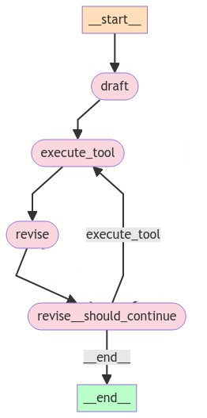

# ReflexionAgent

In BioChatter, we introduced a Reflexion Agent to enhance the learning capabilities of LLM. Reflexion allows agent to reflect on its experiences, score output and self-improve.

## workflow
Here is the workflow of ReflexionAgent:



***draft*** built on LLM that is specifically prompted to generate initial text and action. (mem <- AIMessage(...)).  
***execute tool*** execute tool function based on action/text generated in previous node. (mem <- ToolMessage(...)).  
***revise*** built on LLM, this node plays a crucial role by scoring output, generating self-reflection to provide valuable feedback. (mem <- AIMessage)  
***evaluation*** _should_continue, assess the quality of the generated outputs  
***memory*** a list of BaseMessage

## usage
To use `ReflexionAgent`, we need to implement the following abstract methods:
1. _tool_function(self, state: List[BaseMessage]):   
execute tool function based on previous action/text and return ToolMessage
2. _create_initial_responder(self, prompt: Option[str]):  
create draft responder, which is to draft initial answer
3. _create_revise_responder(self, prompt: Optional[str]):  
create revise responder, which is to score outputs and revise answer
4. _log_step_message(self, step: int, node: str, output: BaseMessage):  
parse step message and generate logs
5. _log_final_result(self, output: BaseMessage):  
parse final result and generate logs
6. _parse_final_result(self, output: BaseMessage):  
parse final result

In kg_langgraph_agent.py, we introduced `KGQueryReflexionAgent` derived from `ReflexionAgent` to generate KG query. In `KGQueryReflexionAgent`, we implemented the above abstract methods:
1. _tool_function(self, state: List[BaseMessage]):  
connect to kg database and query with generated query in draft/revise node
2. _create_initial_responder(self, prompt: Option[str]):  
create initial responder, which prompts LLM to generate answer.
initial prompts:  
```
(
    "system",
    (
        "As a senior biomedical researcher and graph database expert, "
        f"your task is to generate '{query_lang}' queries to extract data from our graph database based on the user's question. "
        """Current time {time}. {instruction}"""
    ),
),
(
    "system",
    "Only generate query according to the user's question above.",
),
```
Initial answer schema:  
```
class GenerateQuery(BaseModel):
    """Generate the query."""

    answer: str = Field(
        description="Cypher query for graph database according to user's question."
    )
    reflection: str = Field(
        description="Your reflection on the initial answer, critique of what to improve"
    )
    search_queries: List[str] = Field(description="query for graph database")
```
3. _create_revise_responder(self, prompt: Optional[str]):  
create revise responder, which prompts LLM to score the outputs, reflect the outputs and revise current query
revise prompts:  
```
"""
Revise your previous query using the query result and follow the guidelines:
1. If you consistently obtain empty results, please consider removing constraints such as relationship constraints to try to obtain a result.
2. You should use previous critique to improve your query.
3. Only generate a query without returning any other text.
"""
```
revise answer schema:  
```
class ReviseQuery(GenerateQuery):
    """Revise your previous query according to your question."""

    revised_query: str = Field(description=REVISED_QUERY_"Revised query"DESCRIPTION)
    score: str = Field(description=(
    "the score for the query based on its query result"
    " and relevance to the user's question,"
    " with 0 representing the lowest score and 10 representing the highest score."))
```
4. _log_step_message(self, step: int, node: str, output: BaseMessage):  
parse step message and generate logs
5. _log_final_result(self, output: BaseMessage):  
parse final result and generate logs
6. _parse_final_result(self, output: BaseMessage):  
parse final result
7. _should_continue(self, state: List[BaseMessage]):  
assess output and determine if we can exit loop based on the following rules:  
  1). if loop steps are greateer than limit (30 or user defined), exit  
  2). if score in previous revise node is greater than 7, exit  
  3). if query result in execute_tool node is not empty, exit  
