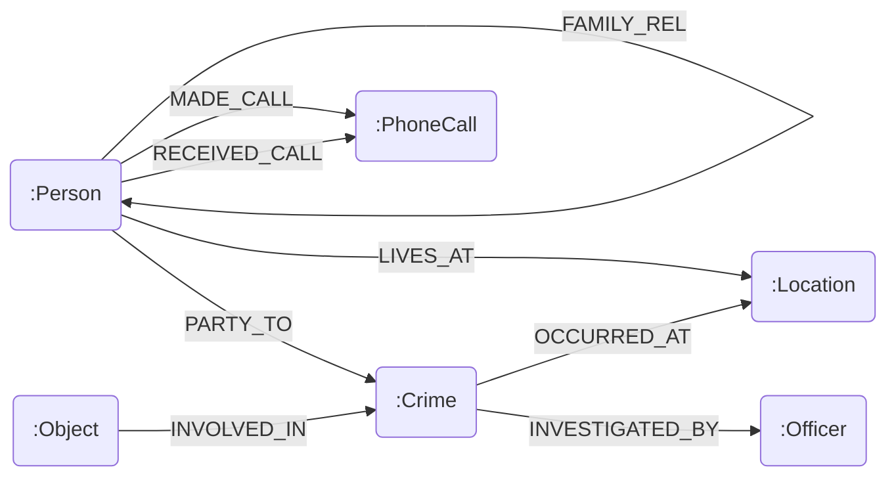
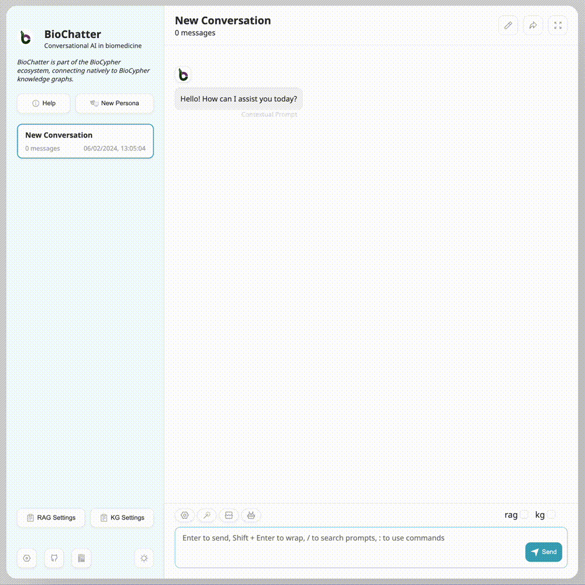

# Vignette: Knowledge Graph RAG

This vignette demonstrates the KG module of BioChatter as used by the
BioChatter Next application. We connect to a BioCypher knowledge graph (KG) to
retrieve relevant information for a given question. We then use the retrieved
information to generate a response to the question. The application can connect
to any real-world BioCypher KG by providing the connection details in the `KG
Settings` dialog.

## Background

For the demonstration purposes of this vignette, we include a demo KG based on
an open-source dataset of crime statistics in Manchester, because it allows us
to redistribute the KG due to its small size and public domain licence, and
because it is easily understood. This is non-trivial for most biomedical
datasets; however, we are currently working on a synthetic biomedical example to
extend this vignette. This is the schema of the demo KG:



The KG is adapted from a [Neo4j
tutorial](https://github.com/neo4j-graph-examples/pole), and is available as a
BioCypher adapter including a BioChatter Light integration
[here](https://github.com/biocypher/pole). We also include it in an optional
BioChatter Next Docker Compose
[configuration](https://github.com/biocypher/biochatter-next/blob/main/biochatter-next/docker-compose-incl-kg.yml)
to allow trying it out locally.

## Usage

In BioChatter Next, we first activate the KG functionality by clicking on the
`KG Settings` button in the sidebar. In the settings dialog, we can activate the
KG functionality and select how many results we want to retrieve. Returning to
the conversation and enabling the KG functionality for the current chat
(directly above the send button), we can then ask the model about the KG. The
language model we use is, as in the RAG vignette, `gpt-3.5-turbo-0613`. The
conversation is pasted below for convenience, including the queries generated by
BioChatter.



In the background, the RagAgent module of BioChatter receives the question and
generates a query to retrieve the desired information. This is then passed back
to the primary model, which includes it in its answer generation.

## Conclusion

The native integration of BioCypher KGs into the BioChatter framework allows for
a seamless integration of KGs into the conversational AI. This in turn
facilitates knowledge accessibility in a wide range of application domains.

## Note: the apparent inability of GPT to understand certain directionalities, and how BioChatter compensates for this

Interestingly, while `gpt-3.5-turbo-0613` mostly does a formidable job at
translating natural language questions into Cypher queries, it is remarkably
obtuse in certain instances. For instance, for the relationship
`INVESTIGATED_BY`, which connects a `Crime` to an `Officer`, GPT consistently
fails to understand that the relationship implies that the `Officer` is the one
who investigates the `Crime`. Instead, it consistently interprets the
relationship as if the `Crime` investigates the `Officer`: it consistently
proposes the query `MATCH (o:Officer)-[:INVESTIGATED_BY]->(c:Crime) RETURN c, o`
instead of the correct `MATCH (c:Crime)-[:INVESTIGATED_BY]->(o:Officer) RETURN
c, o`. We were not able to change this behaviour with any contextual prompt
instructions.

For this reason, the BioChatter `prompts.py` module uses the knowledge we have
about the directionality of edges in the BioCypher KG to only propose options
for patterns that actually exist in the KG. In the instance of
`INVESTIGATED_BY`, this is the corresponding YAML definition in BioCypher:

```yaml
investigated by:
    is_a: [fact, core]
    represented_as: edge
    label_as_edge: INVESTIGATED_BY
    input_label: INVESTIGATED_BY
    source: crime
    target: officer
```

The presence of the `source` and `target` annotations allows us to provide only
the correct options to the LLM, which in turn allows the LLM to generate the
correct query.

Strikingly, this even applies to `GPT-4` and `ChatGPT`, which we used to
generate the Mermaid diagram above. The model immediately proposed a correct
Mermaid diagram for most of the entire schema definition YAML file, except for
the relationship between `Crime` and `Officer`, which it reversed. Via the YAML
we provide in the prompt, GPT has access to the correct directionality, but it
still fails to understand it.

```
graph LR;
    Person(:Person) -- KNOWS --> Person
    Person -- FAMILY_REL --> Person
    Person -- LIVES_AT --> Location(:Location)
    Person -- PARTY_TO --> Crime(:Crime)
    Person -- MADE_CALL --> PhoneCall(:PhoneCall)
    Person -- RECEIVED_CALL --> PhoneCall
    Officer(:Officer) -- INVESTIGATED_BY --> Crime
    Crime -- OCCURRED_AT --> Location
    Object(:Object) -- INVOLVED_IN --> Crime

    classDef node fill:#f9f,stroke:#333,stroke-width:2px;
    class Person,Officer,Location,Crime,PhoneCall,Object node;
```

Here is the [full
chat](https://chat.openai.com/share/8e3b8ed6-c8a2-4460-a1ad-fe637e4c3db1) for
reference.

## Conversation

The boxes below the BioChatter responses in the conversation show the queries
generated by the RagAgent module.

### Message From You
How many crimes happened in total?

### Message From BioChatter
According to the provided statement, the total number of crimes is 28,762. This information suggests that there have been 28,762 reported crimes in the given context. However, without additional information or context, it is difficult to determine the specific time period, location, or nature of these crimes. It's important to note that crime statistics can vary depending on the source, methodology, and reporting practices. Therefore, it is always advisable to consult official crime reports or local law enforcement agencies for the most accurate and up-to-date information on crime statistics.

```note
MATCH (c:Crime)
RETURN count(c) AS numberOfCrimes
```

### Message From You
Where happened most crimes?

### Message From BioChatter
Based on the provided statement, it appears that the location with the highest number of crimes is a parking area, with a total of 811 reported crimes. However, without additional context or information, it is difficult to determine the consistency or inconsistency of this statement with other available information. It is important to note that crime rates and locations can vary significantly depending on various factors such as the region, city, neighborhood, and specific time period being considered. To provide a more comprehensive analysis, it would be helpful to have access to a broader dataset or additional information about the specific location and its crime statistics.

```note
MATCH (c:Crime)-[:OCCURRED_AT]->(l:Location)
RETURN l.address AS location, COUNT(c) AS crimeCount
ORDER BY crimeCount DESC
```

### Message From You
Who were the top 3 offenders?

### Message From BioChatter
Based on the provided information, the top three offenders are:

1. Phillip Williamson: According to the information given, Phillip Williamson has committed 5 crimes.

2. Jessica Kelly: The information states that Jessica Kelly has also committed 5 crimes.

3. Brian Morales: The data indicates that Brian Morales has committed 4 crimes.

These three individuals, Phillip Williamson, Jessica Kelly, and Brian Morales, are the top offenders based on the number of crimes they have committed.

```note
MATCH (p:Person)-[:PARTY_TO]->(c:Crime)
RETURN p.name, p.surname, COUNT(c) AS num_crimes
ORDER BY num_crimes DESC
LIMIT 3
```