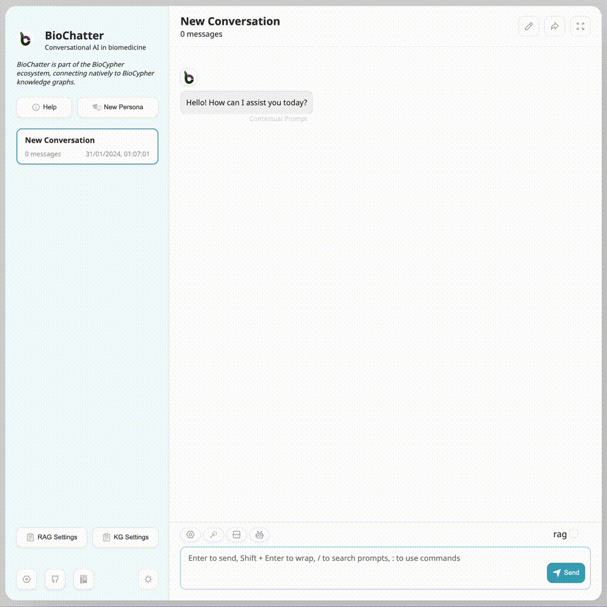

# Vignette: Retrieval-Augmented Generation

This vignette demonstrates the RAG module of BioChatter as used by the
BioChatter Next application. This basic use case involves an LLM manuscript
reading assistant and a vector database with embedded scientific manuscripts.
The manuscripts are recent reviews on the topic of ABC transporters and drug
resistance phenomena, which we currently investigate in our DECIDER cohort.
Manuscripts such as these can be absent from the knowledge base of LLMs for
various reasons, such as their recency or the fact that they are not open
access. RAG opens up the possibility to retrieve relevant information from
these manuscripts, and to inject it into the LLM's generation process.

## Usage

In BioChatter Next, we first activate the RAG functionality by clicking on the
`RAG Settings` button in the sidebar. In the settings dialog, we can activate
the functionality and upload an arbitrary number of documents, which is only
limited by the scale of the vector database system. In this case, and for
demonstration purposes, we uploaded the four manuscripts, which leads to the
state shown in the screenshot below. You can find the citations below.

Note that we chose to split the documents into fragments of 1000 characters
each. We could have split by tokens instead, or changed the fragment length and
overlap. Fragment length, overlap, and splitting by tokens or characters are
decisions that should be made in tandem with the choice of LLM model, and with
the number of fragments that should be retrieved for each query. Most
importantly, the total text length should not exceed the input context length
of the model. Here, we choose to inject 10 fragments per query.

We can now start a new conversation (using the `New Persona` button in the
sidebar), for which we select the `Research manuscript helper (RAG)` persona,
which includes suitable contextual prompts. Upon activating the RAG in the chat
(to signal that we wish to perform RAG for our question), we can enter into a
dialogue with the assistant. We use gpt-3.5-turbo in this example, which is a
very affordable model. The procedure is demonstrated in the GIF below.

## Comparison with ChatGPT

We can ask the same question to ChatGPT 4 (only subscription access).  By
employing web search, ChatGPT 4 is able to find the same study that was the RAG
result we were asked about in our follow-up question (Xu et al. 2015); however,
the answer is not as detailed as the answer provided by the RAG process, and
includes fewer mentions of explicit studies. While it includes sensible
information, there is no way of validating most of the claims made by the model.
You can read the full answer
[here](https://chat.openai.com/share/549f5bf7-b39c-42a4-9483-d07dcbf5b2d9).
Overall, the quality of ChatGPT 4 is comparable to the RAG output, but the user
has less control over the knowledge used, and the answer cannot include
information that is not easily found on the web (for instance due to access
restrictions). Of note, we used gpt-3.5-turbo in this example, which is less
recent and much less expensive than GPT-4.

Asking the naive ChatGPT 3.5 (free access), the same question yields a very
different answer. The free version of ChatGPT cannot search the internet, and
does not provide any citations for the general answer it provides. You can read
the full answer
[here](https://chat.openai.com/share/810075aa-69fe-4c06-859d-229e250f4c41). 

## Conclusion

In conclusion, the RAG procedure we implement is able to dramatically improve
the quality of GPT-3 answers, making them comparable to GPT-4 with web search,
and even surpassing it in some aspects. We invite you to try it out yourself, as
we provide an instance of BioChatter Next, including GPT access and a vector
database instance, free of charge at
[https://next.biochatter.org](https://next.biochatter.org).

## References

- [1] [ABC transporters affects tumor immune microenvironment to regulate cancer
immunotherapy and multidrug
resistance](https://doi.org/10.1016/j.drup.2022.100905)

- [2] [ABC transporters and the hallmarks of cancer: roles in cancer
aggressiveness beyond multidrug
resistance](https://doi.org/10.20892/j.issn.2095-3941.2019.0284)

- [3] [Advances in the structure, mechanism and targeting of
chemoresistance-linked ABC
transporters](https://doi.org/10.1038/s41568-023-00612-3)

- [4] [ATP-binding cassette (ABC) transporters in cancer: A review of recent
updates](https://doi.org/10.1111/jebm.12434)